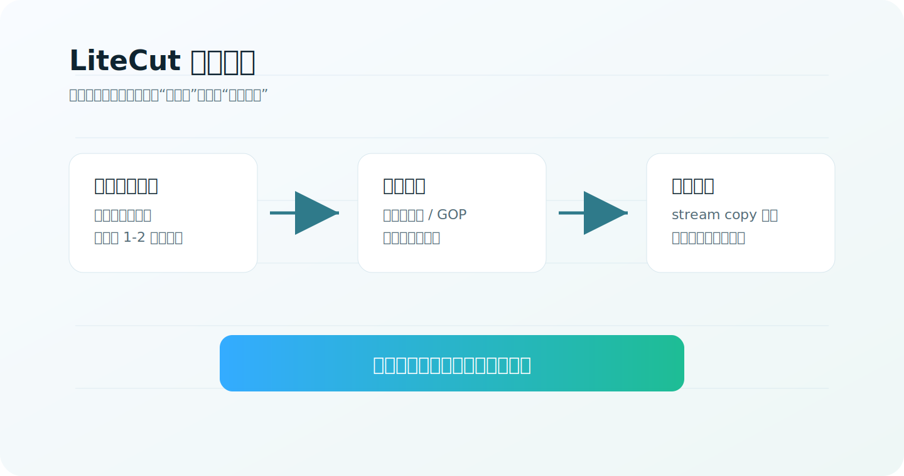
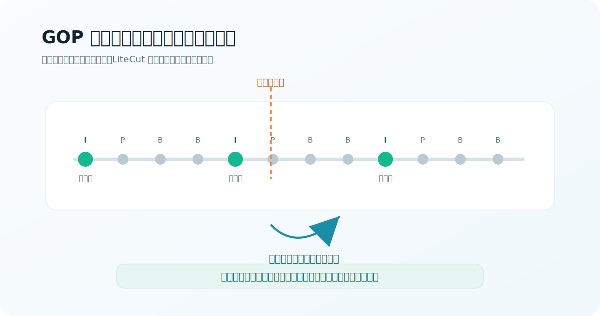
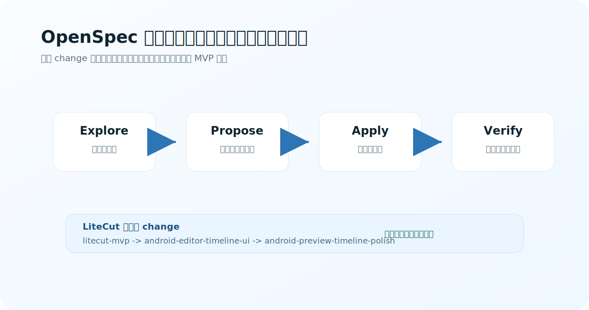
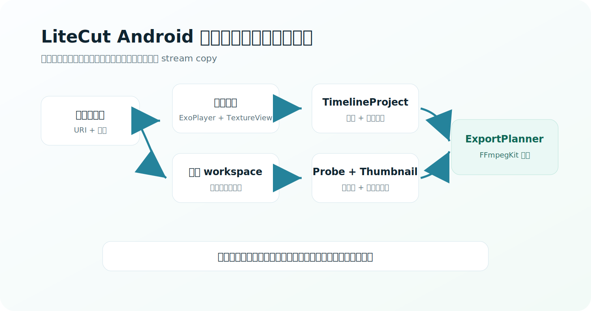

# LiteCut：长视频快剪，不追求帧精确，追求导出够快



LiteCut 的出发点很简单：

> 对一小时以上的长视频来说，早一两秒、晚一两秒，很多时候不重要。真正重要的是：导出不要慢。

所以 LiteCut 不把目标设成“手机上的专业剪辑软件”，而是设成一个更锋利的小工具：

- 基础切割、复制、删除、排序；
- 单轨时间线，能看懂片段；
- 预览要马上出声音、出画面；
- 导出尽量走 stream copy；
- 不为帧级精度付出重编码成本。

核心取舍：

```text
牺牲一点边界精度 -> 避免重编码 -> 长视频导出更快
```

## 关键 idea：用 GOP 边界换速度

视频不是每一帧都能便宜地独立切开。大多数压缩视频由 GOP 组成，关键帧可以独立解码，非关键帧依赖前后帧。

如果硬要按任意一帧精确切，通常就要重编码。LiteCut 反过来：把用户选择的时间点对齐到可 stream-copy 的关键帧边界。



用户点的是“大概从这里开始”。LiteCut 真正导出时会做这种转换：

```text
用户选择点 -> 查找附近关键帧 -> 扩展到安全范围 -> ffmpeg -c copy
```

这不是 bug，这是产品定位。

对于长视频快剪场景，1 秒边界误差往往比 10 分钟导出等待更可接受。

## OpenSpec 怎么帮我们把 idea 做出来

这次最有价值的不是“写了一堆文档”，而是 OpenSpec 让我们一直守住边界。



我们把开发拆成三个 change：

| Change | 解决的问题 | 结果 |
| --- | --- | --- |
| `litecut-mvp` | Android 文件访问、FFmpegKit、stream-copy 计划 | 跑通无损导出核心 |
| `android-editor-timeline-ui` | 中文时间线、片段选择、切割复制排序 | 从工具变成可用 App |
| `android-preview-timeline-polish` | 长视频黑屏、缩略图、缩放滚动、时间映射 | 真机上可预览、可导航 |

OpenSpec 在这里的作用是：

- 每一步先写清楚目标和非目标；
- 每个 change 都有任务清单和验收；
- 发现问题时回到 spec，而不是凭感觉乱改；
- 明确“不做什么”，避免变成另一个大而全的视频编辑器。

最重要的非目标：

```text
不做帧精确
不默认重编码
不做滤镜/转场/多轨
不做逐帧缩略图
```

这让 LiteCut 的方向一直很清楚：快剪，不是精剪。

## App 架构：只保留必要复杂度



实现上只保留几条主线：

- Android 系统选择器导入 URI；
- 立即用 ExoPlayer + TextureView 预览；
- 后台复制到 app 私有 workspace；
- ffprobe 读取时长和关键帧；
- TimelineProject 管理片段和 source-time 映射；
- Thumbnail 只做稀疏生成；
- ExportPlanner 生成 `-c copy` 命令；
- FFmpegKit 执行并发布结果。

这套架构的重点不是复杂，而是把“不重编码导出”这件事保护好。

## 一次关键调试：有声音但黑屏

长视频导入后，声音马上出来，但预览区域黑屏。

一开始容易怀疑视频解码失败。logcat 反而说明：

- 硬解码器在工作；
- render fps 正常；
- SurfaceView 在 queue buffer；
- 本地抽帧不是黑图。

结论：不是视频没解码，而是 `VideoView` / `SurfaceView` 在这个布局里显示路径不可靠。

最后改成：

```text
VideoView -> Media3 ExoPlayer + TextureView
```

预览黑屏解决。这个细节很关键，因为 LiteCut 不是只会导出，真机上也必须能马上预览长视频。

## 为什么这个项目有意思

很多视频工具默认追求“更专业”：更精确、更复杂、更多效果。

LiteCut 追求的是另一个方向：

```text
足够准确 + 极快导出 + 长视频友好
```

它适合这种人：

- 手上有很长的视频；
- 只想剪掉开头结尾或整理几个片段；
- 不想等手机重编码；
- 接受边界粗一点，但不能接受导出慢。

这就是 LiteCut 的价值。

## 开源

项目仓库：

```bash
gh repo clone STEPHENXING/LiteCut-android
```

仓库只包含 LiteCut Android 项目本身。OpenSpec 的 proposal、tasks、change 等开发过程材料没有混进代码仓库。

LiteCut 现在还是 MVP，但方向已经很明确：

> 不是做一个小剪映，而是做一个长视频快剪工具。

